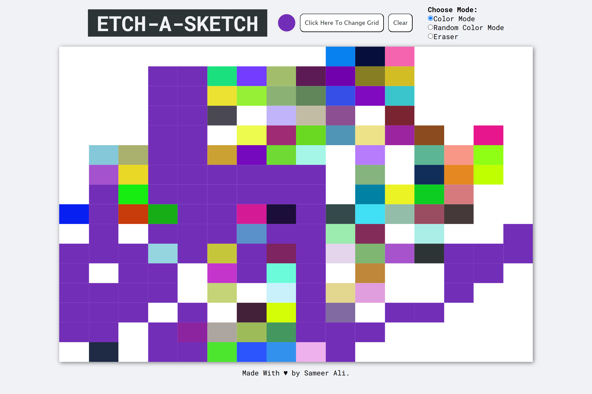

# 🎨 Etch-a-Sketch

A fun and interactive browser-based **Etch-a-Sketch** built with HTML, CSS, and JavaScript as part of [The Odin Project](https://www.theodinproject.com/) curriculum.

---

## 🕹 Features

- ✅ Draw by hovering your mouse over the grid
- 🎨 Choose your drawing color using a color picker
- 🌈 Switch to **Random Color**
- 🧽 Use **Eraser Mode** to remove strokes
- 🔁 Clear the grid at any time
- 🧱 Choose grid size — from **1×1 up to 64×64**

---

## 🚀 How to Use

1. Launch the app in your browser.
2. Set your preferred **grid size** using the Button.
3. Choose your **drawing mode**:
   - **Color Picker** – select a specific color to draw
   - **Random Color** – each square gets a random color
   - **Eraser** – remove drawn pixels
4. Start hovering over the grid to draw!
5. Click **Clear** to reset the grid whenever you like.

---

## 🛠 Tech Stack

- **HTML** – page structure
- **CSS** – styling and layout
- **JavaScript** – logic and interactivity

---

## 📸 Preview

---

## 📚 What I Learned

- DOM manipulation & dynamic element creation
- Event delegation and custom drawing logic
- Handling inputs like sliders and color pickers
- Writing clean, modular JavaScript

---

## 🔗 Live Demo

[Click Here](https://devxsameer.github.io/odin-etch-a-sketch/)

---